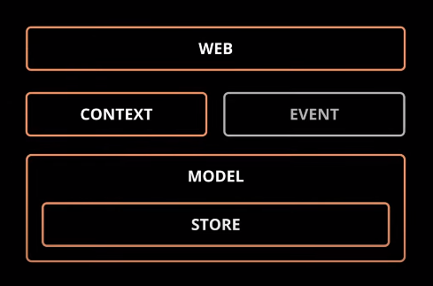

# REST API with Axum by Tokio



### Crates

- [axum](https://crates.io/crates/axum): web framework that focuses on ergonomics and modularity.

- [tokio](https://tokio.rs): platform for writing asynchronous I/O backed applications.

- [tower](https://crates.io/crates/tower): library for building robust clients and servers.

- [serde](https://crates.io/crates/serde): serialization/deserialization framework.

<hr>

## Quick Dev with  Cargo Watch

> NOTE: Install globally cargo watch with `cargo install cargo-watch`.

### Terminal 1 - To run the server.
``` 
cargo watch -q -c -w src/ -x "run"
```
### Terminal 2 - To run the client.
```
cargo watch -q -c -w examples/ -x "run --example quick_dev"
```